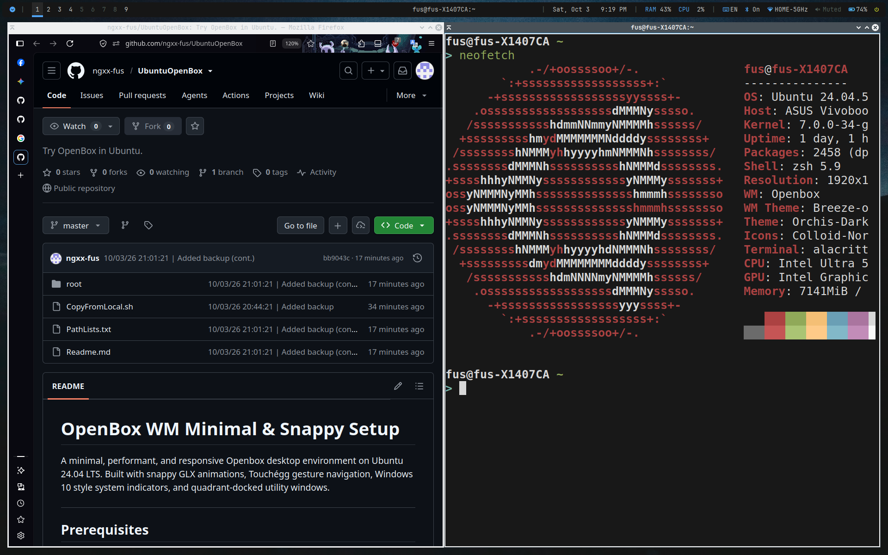
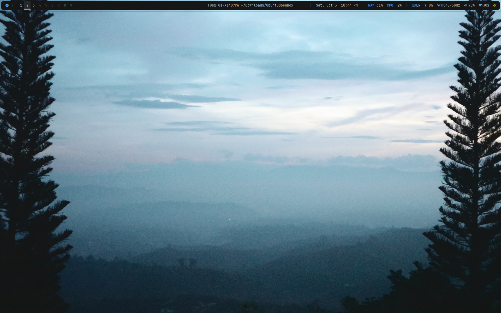
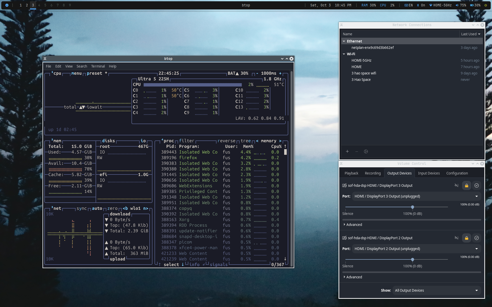

# OpenBox WM Minimal & Snappy Setup

A minimal, performant, and responsive Openbox desktop environment on Ubuntu 24.04 LTS. Built with snappy GLX animations, Touchégg gesture navigation, Windows 10 style system indicators, Dunst OSD notifications, and quadrant-docked utility windows.

---

## Prerequisites

Run the following installation steps sequentially to set up the shell, packages, dependencies, and window management tools.

### 1.1. Shell & Basic Utilities (Zsh & Oh-My-Zsh)

```bash
sudo apt update && sudo apt install -y git curl wget zsh plocate xdg-utils libgtk-3-bin
sh -c "$(curl -fsSL [https://raw.githubusercontent.com/ohmyzsh/ohmyzsh/master/tools/install.sh](https://raw.githubusercontent.com/ohmyzsh/ohmyzsh/master/tools/install.sh))" "" --unattended
git clone [https://github.com/zsh-users/zsh-completions](https://github.com/zsh-users/zsh-completions) ${ZSH_CUSTOM:-~/.oh-my-zsh/custom}/plugins/zsh-completions
chsh -s $(which zsh)

```

### 1.2. Desktop Core Packages & Utilities

```bash
sudo apt update
sudo apt install -y \
    openbox obconf tint2 feh picom rofi \
    volumeicon-alsa network-manager-gnome pamixer \
    lxappearance arc-theme papirus-icon-theme \
    polybar gnome-terminal copyq flameshot \
    pavucontrol bluez blueman upower brightnessctl \
    xdotool x11-utils libnotify-bin thunar

```

### 1.3. Input Method (Fcitx5 Bamboo)

```bash
sudo apt purge -y ibus ibus-data
sudo apt install -y fcitx5 fcitx5-bamboo fcitx5-config-qt fcitx5-frontend-gtk2 fcitx5-frontend-gtk3 fcitx5-frontend-gtk4 fcitx5-frontend-qt5

cat << 'EOF' >> ~/.xprofile
export GTK_IM_MODULE=fcitx
export QT_IM_MODULE=fcitx
export XMODIFIERS=@im=fcitx
EOF

```

### 1.4. Fonts (Nerd Fonts & Material Design Glyphs)

```bash
sudo apt install -y fonts-jetbrains-mono fonts-font-awesome fonts-material-design-icons-iconfont
mkdir -p ~/.local/share/fonts
wget -P ~/.local/share/fonts [https://github.com/ryanoasis/nerd-fonts/releases/latest/download/NerdFontsSymbolsOnly.tar.xz](https://github.com/ryanoasis/nerd-fonts/releases/latest/download/NerdFontsSymbolsOnly.tar.xz)
tar -xf ~/.local/share/fonts/NerdFontsSymbolsOnly.tar.xz -C ~/.local/share/fonts/
rm ~/.local/share/fonts/NerdFontsSymbolsOnly.tar.xz
fc-cache -fv

```

### 1.5. Lockscreen (i3lock-color & Betterlockscreen)

```bash
# Build dependencies for i3lock-color
sudo apt install -y autoconf gcc make pkg-config libpam0g-dev libcairo2-dev \
    libfontconfig1-dev libxcb-composite0-dev libev-dev libx11-xcb-dev libxcb-xkb-dev \
    libxcb-xinerama0-dev libxcb-randr0-dev libxcb-image0-dev libxcb-util-dev \
    libxcb-xrm-dev libxkbcommon-dev libxkbcommon-x11-dev libjpeg-dev libgif-dev

# Build & install i3lock-color
git clone [https://github.com/Raymo111/i3lock-color.git](https://github.com/Raymo111/i3lock-color.git) /tmp/i3lock-color
cd /tmp/i3lock-color && ./build.sh && sudo ./install-i3lock-color.sh
cd ~

# Install Betterlockscreen system executable
git clone [https://github.com/betterlockscreen/betterlockscreen.git](https://github.com/betterlockscreen/betterlockscreen.git) /tmp/betterlockscreen
cd /tmp/betterlockscreen && sudo ./install.sh system
cd ~

# Cache blurred lockscreen wallpaper
betterlockscreen -u ~/.config/openbox/wallpaper/ -b 2.5

```

### 1.6. Expose & Window Switcher (Skippy-XD)

```bash
sudo apt install -y meson ninja-build libx11-dev libxft-dev libxrender-dev \
    libxcomposite-dev libxdamage-dev libxfixes-dev libxinerama-dev libpng-dev

git clone [https://github.com/felixfung/skippy-xd.git](https://github.com/felixfung/skippy-xd.git) /tmp/skippy-xd
cd /tmp/skippy-xd
meson setup build && ninja -C build && sudo ninja -C build install
mkdir -p ~/.config/skippy-xd
cp /tmp/skippy-xd/skippy-xd.rc ~/.config/skippy-xd/skippy-xd.rc
cd ~

```

### 1.7. Multi-touch Touchpad Gestures (Touchégg)

```bash
sudo add-apt-repository ppa:touchegg/stable -y
sudo apt update && sudo apt install -y touchegg
sudo systemctl enable --now touchegg.service

```

### 1.8. Standalone Super Key Mapping (xcape)

```bash
sudo apt update && sudo apt install -y xcape

```

---

## Configuration Paths

All dotfiles and operational configurations are organized in the following locations:

| Path | Description |
| --- | --- |
| `~/.config/openbox/autostart` | Session startup script (spawns Polybar, Picom, Fcitx5, xcape, daemons) |
| `~/.config/openbox/environment` | Session environment variables |
| `~/.config/openbox/rc.xml` | Keybindings, focus policies, window placement rules, and titlebar decorations |
| `~/.config/openbox/menu.xml` | Openbox root desktop right-click menu |
| `~/.config/openbox/polybar/` | Polybar root configurations (`config.ini`, `colors.ini`, `polybar-ob` launch helper) |
| `~/.config/polybar/scripts/power_stat` | Custom battery telemetry script (Power W, %, ECT, charge states) |
| `~/.config/polybar/scripts/bluetooth.sh` | Bluetooth status and paired device connection monitor |
| `~/.config/polybar/scripts/backlight_check.sh` | Auto-detect active internal eDP/LVDS display; handles brightness and hides module when absent |
| `~/.config/openbox/scripts/changebrightness` | Screen brightness control with Dunst sync progress bar |
| `~/.config/openbox/scripts/change_keyboard_brightlight` | Asus notebook keyboard backlight toggle script |
| `~/.config/openbox/scripts/changevolume` | Audio volume and mute control with Dunst sync progress bar |
| `~/.config/openbox/scripts/switch_display.sh` | Multi-monitor display projection mode switcher (Win + P style via Rofi) |
| `~/.config/openbox/scripts/lock_screen.sh` | Betterlockscreen invocation hook |
| `~/.config/openbox/scripts/power` | Power session management menu (Lock, Suspend, Reboot, Shutdown) |
| `~/.config/openbox/picom/picom.conf` | Fast GLX compositor setup, shadows, and low-latency fading animations |
| `~/.config/openbox/rofi/` | Application launcher themes (`config.rasi`, `combi.rasi`, `power.rasi`, `popup.rasi`, `keybinds.rasi`) |
| `~/.config/openbox/dunst/dunstrc` | Lightweight desktop notification styling and position rules |
| `~/.config/openbox/wallpaper/` | Bundled high-resolution desktop wallpapers |
| `~/.config/skippy-xd/skippy-xd.rc` | Layout and activation settings for the Expose window switcher |
| `~/.config/touchegg/touchegg.conf` | Multi-finger gesture bindings (window switcher, workspaces, expose) |
| `~/.config/Thunar/uca.xml` | Thunar custom actions and context menu extensions |
| `~/.themes/Breeze-ob-custom/openbox-3/themerc` | Window border styling, frame metrics, and colors |
| `/etc/X11/xorg.conf.d/30-touchpad.conf` | Xorg driver configuration for touchpad tap-to-click and natural scrolling |
| `/etc/systemd/logind.conf` | System power key interception (`HandlePowerKey=ignore`) |

---

## Keybindings & Shortcuts Reference

| Shortcut / Action | Command / Action | Description |
| --- | --- | --- |
| `Super` (Tap) | `xcape (Alt+Tab -> skippy-xd)` | Show all windows overview (like GNOME Activities) |
| `Alt + Space` | `rofi -show combi ...` | Open unified multi-mode launcher |
| `Super + d` | `ToggleShowDesktop` | Hide / Restore all active windows |
| `Super + x` / `Power Button` | `~/.config/openbox/scripts/power` | Open power and logout menu |
| `Super + r` | `gnome-terminal` | Launch default GNOME Terminal |
| `Super + p` | `~/.config/openbox/scripts/switch_display.sh` | Multi-display projection switcher (PC only, Duplicate, Extend, Second only) |
| `Super + b` | `firefox` | Open web browser |
| `Super + v` | `copyq toggle` | Open clipboard manager history |
| `Super + l` | `betterlockscreen -l blur` | Lock screen with blurred wallpaper |
| `Super + Shift + s` | `flameshot gui` | Interactive screen region capture |
| `Alt + Tab` / `Super + Tab` | `skippy-xd --toggle --expose` | Window expose overview |
| `Super + Left / Right` | `MoveResizeTo (50% split)` | Snap window to left or right half-screen |
| `Super + Up` | `ToggleMaximize` | Toggle window maximization |
| `Super + Down` | `MoveToCenter (50% size)` | Restore and center floating window |
| `Super + Space` | `fcitx5-remote -t` | Toggle input engine (Vietnamese / English) |
| `XF86MonBrightnessUp / Down` | `changebrightness {up | down}` |
| `XF86KbdBrightnessUp / Down` | `change_keyboard_brightlight` | Toggle Asus keyboard backlight levels |
| `XF86AudioRaise / Lower / Mute` | `changevolume {up | down |
| `Swipe 3 fingers (Left / Right)` | Touchégg | Switch virtual desktop workspaces |
| `Swipe 4 fingers (Up)` | Touchégg (`skippy-xd`) | Trigger expose overview mode |

---

## Polybar Module Highlights

* **Dynamic Backlight (`backlight_ext`)**: Controlled via `backlight_check.sh`. Automatically detects if the internal panel (`eDP`/`LVDS`) is connected. When absent or lid is closed, the module hides cleanly without breaking bar layout or throwing unparsed `%percentage%%` errors.
* **Smart Audio Control (`pulseaudio`)**: Wrapped with action tags (`%{A4:...}%{A5:...}`) so mouse-wheel scrolling directly executes `changevolume` to trigger the Dunst OSD.
* **Simplified Ethernet (`eth`)**: Clean icon-only representation (`󰈀`) that completely hides itself when disconnected.
* **Wi-Fi Manager (`wlan`)**: Shows Wi-Fi status and opens `gnome-terminal -- nmtui-connect` on click when disconnected.

---

## Misc Notes

* `openbox --reconfigure` : Reload Openbox keybindings and window placement rules.
* `openbox --restart` : Restart Openbox in-place to apply global frame decoration changes.
* `polybar-msg cmd restart` : Reload Polybar configuration without logging out.
* `xprop WM_CLASS` : Click on any window to obtain its exact instance and class strings.
* `xwininfo -name "<Title>"` : Identify top-level window ID and geometry by window title.
* `betterlockscreen -u ~/.config/openbox/wallpaper/ -b 2.5` : Regenerate cached lockscreen backgrounds.

## Preview

```

```








 